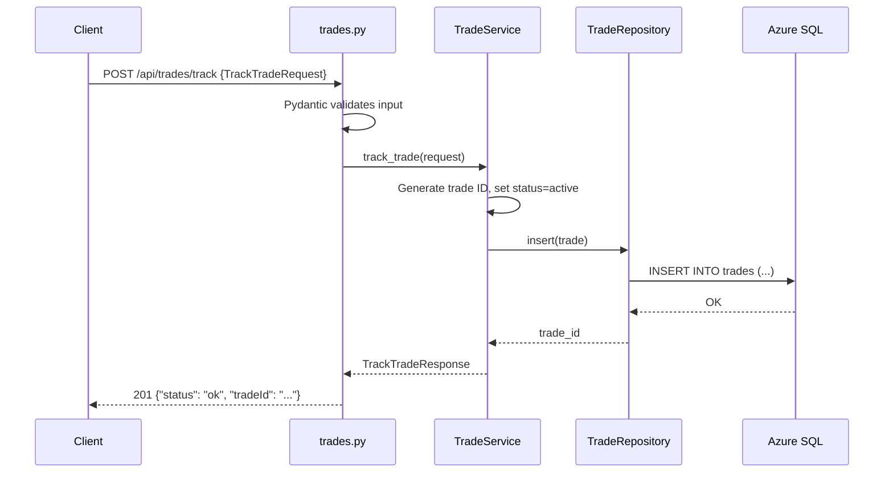
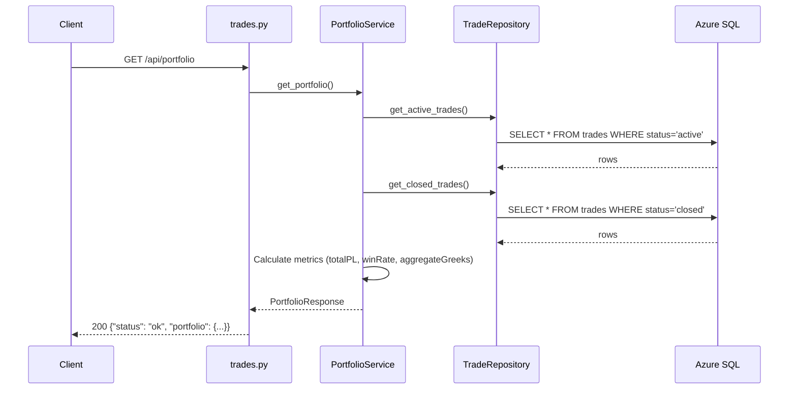
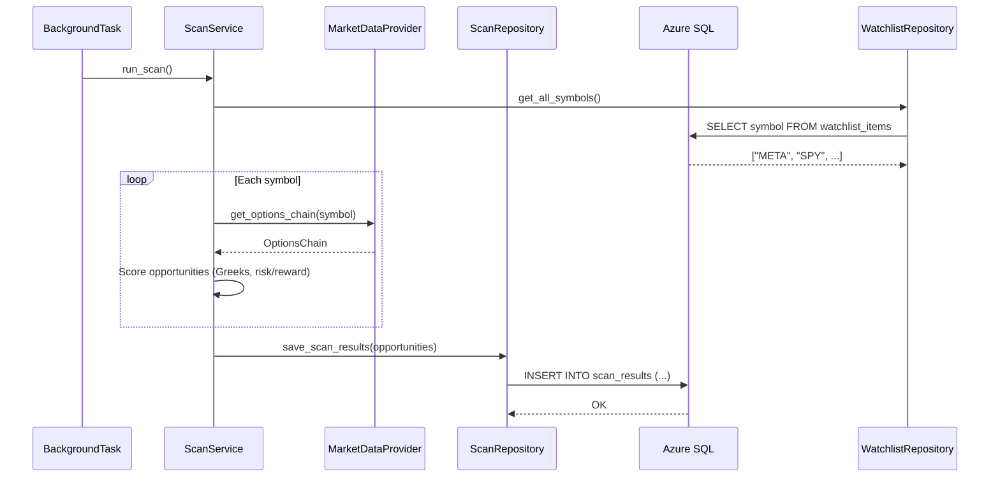
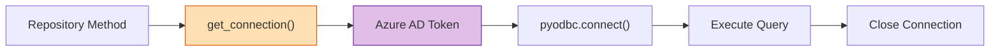
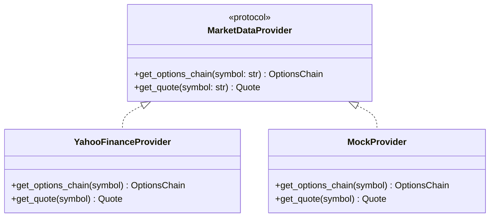

# ADR-1: Options Scanner Backend — Architecture for Stability & Feature Enhancement

**Status**: Accepted  
**Date**: 2026-02-14  
**Author**: Solution Architect Agent  
**Epic**: #1  
**Issue**: #1  
**PRD**: [PRD-1.md](../prd/PRD-1.md)

---

## Table of Contents

1. [Context](#context)
2. [Decision](#decision)
3. [Options Considered](#options-considered)
4. [Rationale](#rationale)
5. [Consequences](#consequences)
6. [Implementation](#implementation)
7. [References](#references)

---

## Context

The Options Scanner Backend is a FastAPI application deployed on Azure App Service. It connects to Azure SQL via Managed Identity (`pyodbc` + `DefaultAzureCredential`). Currently **all endpoints return hardcoded data** — the database layer (`db.py`) exists but is unused. We need an architecture that:

- Adds database persistence for trades, watchlist, and scan results
- Introduces a service layer between endpoints and the database
- Supports a pluggable market data provider
- Maintains backward API compatibility with the existing frontend
- Handles the known pyodbc Linux segfault risk gracefully

**Requirements (from PRD-1):**
- P0: Database persistence, input validation, error handling, tests
- P1: Live market data integration, background scanning, API auth, configuration
- Backward-compatible JSON response shapes
- ≥80% test coverage

**Constraints:**
- Azure SQL Database (ODBC Driver 18, Managed Identity)
- Python 3.11, FastAPI, deployed on Azure App Service (Linux)
- Single-developer team — architecture must stay simple
- No ORM mandated — raw SQL via pyodbc is acceptable

---

## Decision

We will adopt a **layered architecture** with three tiers inside the FastAPI application:

```
┌──────────────────────────────────────────┐
│                  Routers                 │  ← FastAPI route handlers
│         (thin: validate + delegate)      │
├──────────────────────────────────────────┤
│              Service Layer               │  ← Business logic, calculations
│    TradeService · WatchlistService        │
│    ScanService  · PortfolioService        │
├──────────────────────────────────────────┤
│            Repository Layer              │  ← Data access (SQL via pyodbc)
│    TradeRepository · WatchlistRepository  │
│    ScanRepository                         │
├──────────────────────────────────────────┤
│          Database (Azure SQL)            │
└──────────────────────────────────────────┘
```

**Key architectural choices:**

1. **Repository pattern for data access** — Each table gets a repository class that encapsulates SQL queries. Connection lifecycle managed via context managers.
2. **Service layer for business logic** — Portfolio metric calculations, Greeks aggregation, opportunity scoring live here. Services call repositories, never raw SQL.
3. **Router-level input validation via Pydantic** — Replace `Dict[str, Any]` with typed models. FastAPI handles 422 automatically.
4. **Provider abstraction for market data** — `MarketDataProvider` protocol with concrete implementations (e.g., `YahooFinanceProvider`). Swappable without changing service logic.
5. **Connection pooling via module-level factory** — Reuse `get_connection()` from `db.py` with retry logic added. No ORM overhead.
6. **Background tasks via FastAPI `BackgroundTasks` + `asyncio`** — For scheduled scans. No external task queue needed at current scale.

---

## Options Considered

### Option 1: Layered Architecture (Repository + Service)

**Description:**
Introduce repository classes for each table and service classes for business logic. Routers become thin delegation layers. All within the same FastAPI process.

**Pros:**
- Clean separation of concerns
- Easy to test (mock repositories in service tests, mock services in router tests)
- No new infrastructure required
- Simple enough for a single developer

**Cons:**
- More files than the current monolithic `main.py`
- Slight overhead for small app
- No async DB driver (pyodbc is synchronous)

**Effort**: M  
**Risk**: Low

---

### Option 2: ORM-based (SQLAlchemy / SQLModel)

**Description:**
Use SQLAlchemy or SQLModel ORM to define models, manage migrations (Alembic), and handle queries.

**Pros:**
- Automated migrations via Alembic
- Pythonic query builder
- Model validation built into SQLModel

**Cons:**
- Adds heavy dependency (SQLAlchemy ecosystem)
- Azure SQL + Managed Identity token auth is non-trivial with SQLAlchemy
- Existing `db.py` uses raw pyodbc with token injection — significant refactor to adapt
- ORM overhead not justified for 3 tables
- Team already has working pyodbc pattern

**Effort**: L  
**Risk**: Medium (Azure AD token integration with SQLAlchemy is fragile)

---

### Option 3: Minimal (Keep Monolithic main.py)

**Description:**
Add SQL queries directly inside existing route handlers in `main.py`. No new files or layers.

**Pros:**
- Fastest to implement
- No refactoring needed

**Cons:**
- `main.py` is already 528 lines — will become unmaintainable
- Impossible to unit test business logic independently
- Violates single-responsibility principle
- Not scalable as features grow

**Effort**: S  
**Risk**: High (tech debt, test difficulty)

---

## Rationale

We chose **Option 1: Layered Architecture** because:

1. **Right-sized complexity**: 3 tables, 4 services — a repository pattern is proportionate. ORM is overkill; monolithic is too fragile.
2. **Testability**: Service layer can be tested with mocked repositories. Repository layer tested with real DB in integration tests. This cleanly achieves ≥80% coverage.
3. **Existing infrastructure compatibility**: `db.py` with raw `pyodbc` + Managed Identity token injection works. Repository classes wrap this pattern — no need to fight SQLAlchemy's session/engine model with Azure AD tokens.
4. **Provider abstraction for market data**: A `Protocol`-based provider interface lets us swap Yahoo Finance, Tradier, or a mock provider without touching service logic. Critical for testing and future extensibility.

---

## Consequences

### Positive
- Clear testable boundaries (router → service → repository)
- `main.py` shrinks from 528 lines to ~100 (router imports + middleware only)
- Market data provider is swappable — testing uses a mock provider
- Database logic is isolated — can migrate to async driver later without changing services

### Negative
- More files to navigate (~12 new files across services/repositories)
- Synchronous pyodbc means DB calls block the event loop (mitigated by FastAPI's threadpool executor for sync endpoints)

### Neutral
- Migration scripts are raw SQL files, not Alembic — simpler but manual
- No caching layer initially — can add Redis later behind repository interface

---

## Implementation

### Target Project Structure

```
app/
├── main.py                    # FastAPI app, middleware, startup
├── config.py                  # Settings dataclass (enhanced)
├── db.py                      # Connection factory (enhanced with retry)
├── models.py                  # Pydantic response models (existing)
├── schemas.py                 # Pydantic request models (NEW)
├── exceptions.py              # Custom exceptions + global handler (NEW)
├── dependencies.py            # FastAPI dependency injection (NEW)
├── routers/
│   ├── __init__.py
│   ├── health.py              # /healthz, /health, /diagnostics
│   ├── trades.py              # /api/trades/*, /api/portfolio
│   ├── watchlist.py           # /api/watchlist/*
│   ├── scan.py                # /api/scan, /api/multi-leg-opportunities
│   └── logs.py                # /api/logs
├── services/
│   ├── __init__.py
│   ├── trade_service.py       # Trade CRUD + portfolio calculations
│   ├── watchlist_service.py   # Watchlist CRUD
│   ├── scan_service.py        # Scan orchestration + scheduling
│   └── portfolio_service.py   # Portfolio metric aggregation
├── repositories/
│   ├── __init__.py
│   ├── trade_repository.py    # trades table SQL
│   ├── watchlist_repository.py # watchlist_items table SQL
│   └── scan_repository.py     # scan_results table SQL
├── providers/
│   ├── __init__.py
│   ├── base.py                # MarketDataProvider protocol
│   ├── yahoo_finance.py       # Yahoo Finance implementation
│   └── mock_provider.py       # Mock for testing
└── middleware/
    ├── __init__.py
    ├── auth.py                # API key middleware
    └── error_handler.py       # Global exception handler
migrations/
├── 001_create_trades.sql
├── 002_create_watchlist.sql
└── 003_create_scan_results.sql
tests/
├── conftest.py
├── unit/
│   ├── test_models.py
│   ├── test_config.py
│   ├── test_trade_service.py
│   ├── test_watchlist_service.py
│   └── test_portfolio_service.py
└── integration/
    ├── test_trades_api.py
    ├── test_watchlist_api.py
    └── test_scan_api.py
```

### Database Schema

```
┌─────────────────────────────────────────────┐
│                   trades                     │
├─────────────────────────────────────────────┤
│ id              VARCHAR(50)    PK            │
│ opportunity_id  VARCHAR(50)    NOT NULL       │
│ symbol          VARCHAR(10)    NOT NULL       │
│ strike_price    DECIMAL(12,2)  NOT NULL       │
│ expiration_date DATE           NOT NULL       │
│ option_type     VARCHAR(4)     NOT NULL       │  ← CALL / PUT
│ entry_price     DECIMAL(12,4)  NOT NULL       │
│ current_price   DECIMAL(12,4)  NOT NULL       │
│ exit_price      DECIMAL(12,4)  NULL           │
│ quantity        INT            NOT NULL       │
│ underlying_price DECIMAL(12,2) NOT NULL       │
│ delta           DECIMAL(8,4)                  │
│ gamma           DECIMAL(8,4)                  │
│ theta           DECIMAL(8,4)                  │
│ vega            DECIMAL(8,4)                  │
│ entry_date      BIGINT         NOT NULL       │  ← epoch ms
│ exit_date       BIGINT         NULL           │
│ status          VARCHAR(10)    NOT NULL       │  ← active/closed
│ created_at      DATETIME2      DEFAULT NOW    │
│ updated_at      DATETIME2      DEFAULT NOW    │
└─────────────────────────────────────────────┘

┌─────────────────────────────────────────────┐
│              watchlist_items                  │
├─────────────────────────────────────────────┤
│ id              INT            PK IDENTITY   │
│ symbol          VARCHAR(10)    UNIQUE, NOT NULL│
│ added_at        DATETIME2      DEFAULT NOW    │
└─────────────────────────────────────────────┘

┌─────────────────────────────────────────────┐
│              scan_results                    │
├─────────────────────────────────────────────┤
│ id              VARCHAR(50)    PK            │
│ symbol          VARCHAR(10)    NOT NULL       │
│ strike_price    DECIMAL(12,2)  NOT NULL       │
│ expiration_date DATE           NOT NULL       │
│ option_type     VARCHAR(4)     NOT NULL       │
│ current_price   DECIMAL(12,4)                 │
│ underlying_price DECIMAL(12,2)                │
│ implied_volatility DECIMAL(8,4)               │
│ delta           DECIMAL(8,4)                  │
│ gamma           DECIMAL(8,4)                  │
│ theta           DECIMAL(8,4)                  │
│ vega            DECIMAL(8,4)                  │
│ potential_gain  DECIMAL(12,4)                 │
│ potential_loss  DECIMAL(12,4)                 │
│ risk_reward_ratio DECIMAL(8,4)                │
│ confidence_score DECIMAL(5,2)                 │
│ strategy_type   VARCHAR(30)    NULL           │  ← for multi-leg
│ scan_timestamp  BIGINT         NOT NULL       │
│ created_at      DATETIME2      DEFAULT NOW    │
└─────────────────────────────────────────────┘
```

### Data Flow Diagrams

#### Trade Tracking Flow



#### Portfolio Retrieval Flow



#### Scan Flow (with Market Data Provider)



### Key Patterns

#### Connection Lifecycle (Repository Pattern)



Each repository method:
1. Acquires a connection via `get_connection()`
2. Executes parameterized SQL
3. Closes connection via `with` statement (context manager)
4. Returns domain objects (Pydantic models)

#### Market Data Provider Protocol



---

### Key Milestones

- **Phase 1 (Week 1-2)**: Migration scripts + repository layer + service layer + router refactor + typed schemas + error handling + tests
- **Phase 2 (Week 3-4)**: Market data provider + scan service + background scheduler + API auth + config enhancement

---

## References

### Internal
- [PRD-1](../prd/PRD-1.md) — Product requirements
- [SPEC-2](../specs/SPEC-2.md) — Database & Persistence Layer spec
- [SPEC-8](../specs/SPEC-8.md) — Market Data Integration spec

### External
- [FastAPI Documentation](https://fastapi.tiangolo.com/)
- [pyodbc Azure SQL + Managed Identity](https://learn.microsoft.com/en-us/azure/azure-sql/database/connect-query-python)
- [Repository Pattern](https://martinfowler.com/eaaCatalog/repository.html)

---

## Review History

| Date | Reviewer | Status | Notes |
|------|----------|--------|-------|
| 2026-02-14 | Solution Architect Agent | Accepted | Initial ADR |

---

**Author**: Solution Architect Agent  
**Last Updated**: 2026-02-14
