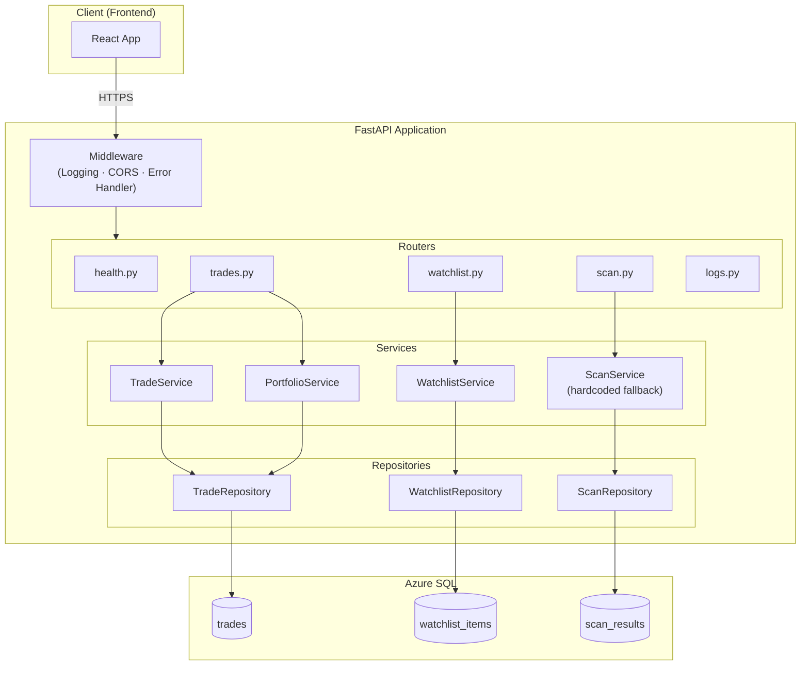
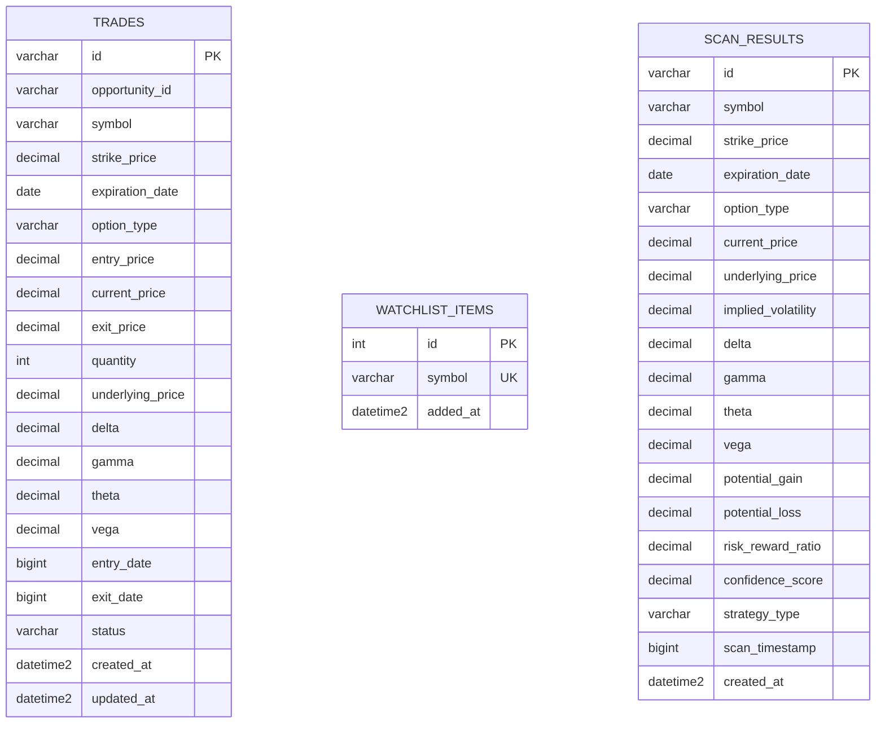
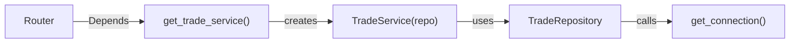

# Technical Specification: Database Schema, Persistence & Stability Layer

**Issue**: #2, #3, #4, #5, #6, #7  
**Epic**: #1  
**Status**: Approved  
**Author**: Solution Architect Agent  
**Date**: 2026-02-14  
**Related ADR**: [ADR-1.md](../adr/ADR-1.md)

> **Acceptance Criteria**: Defined in the PRD user stories — see [PRD-1.md](../prd/PRD-1.md#5-user-stories--features).

---

## 1. Overview

This spec covers the **Phase 1 (P0) stability work**: database schema & migrations, trade/watchlist CRUD persistence, input validation, structured error handling, and test suite setup. It transforms the backend from a hardcoded demo into a functional persistence-backed API.

**Scope:**
- In scope: SQL migrations, repository layer, service layer, router refactor, Pydantic request models, error handling, pytest foundation
- Out of scope: Market data integration (SPEC-8), background scheduler, API auth, rate limiting

**Success Criteria:**
- All 3 tables created in Azure SQL
- All endpoints read/write from database (zero hardcoded data in production paths)
- All POST endpoints use typed Pydantic request models
- Consistent error response format across all endpoints
- Test coverage ≥80%

---

## 2. Architecture Diagrams

### 2.1 Phase 1 System Architecture



---

## 3. API Design

### 3.1 Request Models (NEW: `app/schemas.py`)

All POST endpoints will accept typed Pydantic models instead of `Dict[str, Any]`.

#### TrackTradeRequest

```
Fields:
  opportunityId  : str           (required)
  symbol         : str           (required, uppercase, 1-10 chars)
  strikePrice    : float         (required, > 0)
  expirationDate : str           (required, YYYY-MM-DD format)
  optionType     : str           (required, "CALL" or "PUT")
  entryPrice     : float         (required, > 0)
  currentPrice   : float         (required, >= 0)
  quantity       : int           (required, > 0)
  underlyingPrice: float         (required, > 0)
  greeks         : Greeks        (required)
```

#### CloseTradeRequest

```
Fields:
  tradeId   : str    (required)
  exitPrice : float  (required, >= 0)
```

#### WatchlistRequest

```
Fields:
  symbol : str  (required, uppercase, 1-10 chars)
```

#### LogEntryRequest

```
Fields:
  level   : str           (required, one of: debug/info/warning/error)
  message : str           (required)
  data    : dict | None   (optional)
```

### 3.2 Response Contract Compatibility

All response shapes MUST match existing format. New fields can be added, existing fields cannot be removed.

| Endpoint | Response Shape (unchanged) |
|----------|---------------------------|
| `GET /api/scan` | `{"status": "ok", "opportunities": [...]}` |
| `GET /api/portfolio` | `{"status": "ok", "portfolio": {"metrics": {...}, "activeTrades": [...], "closedTrades": [...]}}` |
| `GET /api/watchlist` | `{"status": "ok", "symbols": [...]}` |
| `POST /api/trades/track` | `{"status": "ok", "tradeId": "...", "message": "..."}` |
| `POST /api/trades/close` | `{"status": "ok", "tradeId": "...", "realizedPL": ..., "message": "..."}` |
| `POST /api/watchlist/add` | `{"status": "ok", "symbol": "...", "message": "..."}` |
| `POST /api/watchlist/remove` | `{"status": "ok", "symbol": "...", "message": "..."}` |

### 3.3 Error Response Format (NEW: all endpoints)

```
{
  "status": "error",
  "detail": "Human-readable error message",
  "code": 422
}
```

| Scenario | HTTP Code | detail |
|----------|-----------|--------|
| Invalid request body | 422 | Pydantic validation message |
| Resource not found | 404 | "Trade trade-123 not found" |
| Database connection failure | 503 | "Database unavailable" |
| Unexpected server error | 500 | "Internal server error" |

---

## 4. Data Model

### 4.1 Migration Scripts

Three idempotent SQL scripts in `migrations/`:

#### `001_create_trades.sql`

```
Table: trades
- Uses IF NOT EXISTS pattern for idempotency
- PK: id (VARCHAR(50)) — generated as "trade-{uuid4}" by service
- Indexes: ix_trades_symbol, ix_trades_status
- Stores Greeks as flat columns (delta, gamma, theta, vega)
- entry_date / exit_date as BIGINT (epoch milliseconds) to match frontend
- status: 'active' or 'closed'
```

#### `002_create_watchlist.sql`

```
Table: watchlist_items
- PK: id (INT IDENTITY)
- UNIQUE constraint on symbol
- symbol: VARCHAR(10)
- Seed with default symbols: META, SPY, AAPL, NVDA
```

#### `003_create_scan_results.sql`

```
Table: scan_results
- PK: id (VARCHAR(50))
- Indexes: ix_scan_symbol, ix_scan_timestamp
- strategy_type nullable (NULL for single-leg, value for multi-leg)
```

### 4.2 Entity Relationship



---

## 5. Service Layer

### 5.1 TradeService

**Responsibilities:**
- `track_trade(request) → TrackTradeResponse` — Generate ID, set status=active, calculate unrealizedPL, insert
- `close_trade(request) → CloseTradeResponse` — Fetch trade, calculate realizedPL, update with exit data
- `get_trade(trade_id) → TrackedTrade` — Read single trade

### 5.2 PortfolioService

**Responsibilities:**
- `get_portfolio() → PortfolioResponse` — Fetch all trades, split active/closed, calculate aggregate metrics

**Portfolio Metrics Calculation:**
```
totalValue    = sum(active.currentPrice * active.quantity * 100)
totalPL       = sum(active.unrealizedPL) + sum(closed.realizedPL)
totalPLPercent = totalPL / totalInvested * 100
winRate       = closedWins / totalClosed * 100
aggregateGreeks.delta = sum(active.delta * active.quantity)
  (same for gamma, theta, vega)
```

### 5.3 WatchlistService

**Responsibilities:**
- `get_symbols() → list[str]` — Return all watchlist symbols
- `add_symbol(symbol) → WatchlistResponse`  — Insert (handle duplicate gracefully)
- `remove_symbol(symbol) → WatchlistResponse` — Delete (handle not-found gracefully)

### 5.4 ScanService (Phase 1: hardcoded fallback)

In Phase 1, `ScanService` returns hardcoded sample data (preserving current behavior). In Phase 2 (SPEC-8), it will delegate to a `MarketDataProvider`.

---

## 6. Security

### 6.1 SQL Injection Prevention

All repository methods MUST use parameterized queries:
```
cursor.execute("SELECT * FROM trades WHERE id = ?", (trade_id,))
```
Never string-format SQL.

### 6.2 Input Validation

Pydantic models enforce:
- `symbol`: regex `^[A-Z]{1,10}$`
- `optionType`: literal `"CALL" | "PUT"`
- `strikePrice`, `entryPrice`: `> 0`
- `quantity`: `> 0`
- `expirationDate`: valid date format

---

## 7. Performance

- **Connection per request**: Each repository call opens/closes a connection. At current scale (< 50 concurrent), this is acceptable.
- **No connection pooling in Phase 1**: pyodbc + Managed Identity token refresh makes pooling complex. Revisit in Phase 3.
- **Response time target**: < 500ms for all CRUD endpoints.

---

## 8. Testing Strategy

| Type | What to Test | Target |
|------|-------------|--------|
| **Unit** | Pydantic models (valid/invalid), config loading, service logic (with mocked repos), portfolio calculations | ≥80% coverage |
| **Integration** | API endpoints via `TestClient`, full request/response cycle with mocked DB | Happy path + error paths |
| **Repository** | Actual SQL queries against test database (optional, CI-only) | All CRUD operations |

### Test Structure

```
tests/
├── conftest.py              # TestClient, mock fixtures
├── unit/
│   ├── test_models.py       # Pydantic model validation
│   ├── test_schemas.py      # Request model validation
│   ├── test_config.py       # Settings loading
│   ├── test_trade_service.py
│   ├── test_watchlist_service.py
│   └── test_portfolio_service.py
└── integration/
    ├── test_trades_api.py
    ├── test_watchlist_api.py
    ├── test_scan_api.py
    └── test_health_api.py
```

### Key Test Patterns

- **Service tests**: Mock repository, verify business logic (e.g., portfolio metric math)
- **API integration tests**: Use `TestClient` with dependency override to inject mock services
- **Fixture**: `conftest.py` provides `client` (TestClient), `mock_trade_repo`, `mock_watchlist_repo`

---

## 9. Implementation Notes

### File-by-File Change Plan

| File | Action | Details |
|------|--------|--------|
| `app/main.py` | **Refactor** | Extract all route handlers to routers. Keep only app creation, middleware, startup. ~100 lines. |
| `app/config.py` | **Enhance** | Add `allowed_origins`, `api_key`, `scan_interval_minutes`, `log_retention` fields |
| `app/db.py` | **Enhance** | Add retry logic (3 retries with exponential backoff) to `get_connection()` |
| `app/models.py` | **Keep** | Existing response models unchanged |
| `app/schemas.py` | **Create** | Request models: `TrackTradeRequest`, `CloseTradeRequest`, `WatchlistRequest`, `LogEntryRequest` |
| `app/exceptions.py` | **Create** | `DatabaseError`, `NotFoundError`, `ValidationError` + global handler |
| `app/dependencies.py` | **Create** | Dependency injection for services (FastAPI `Depends()`) |
| `app/routers/*.py` | **Create** | 5 router files (health, trades, watchlist, scan, logs) |
| `app/services/*.py` | **Create** | 4 service files |
| `app/repositories/*.py` | **Create** | 3 repository files |
| `migrations/*.sql` | **Create** | 3 migration scripts |
| `tests/**` | **Create** | conftest + unit + integration tests |
| `requirements.txt` | **Update** | Add `pytest`, `httpx` (for TestClient), `pytest-cov` |

### Dependency Injection Pattern



FastAPI `Depends()` creates service instances per request. In tests, override dependencies with mocks.

### Migration Execution

Migrations run via a utility script or manual execution:
```
python -m app.migrate
```
Or directly via `sqlcmd` / Azure Data Studio. Scripts are idempotent (use `IF NOT EXISTS`).

---

## 10. Rollout Plan

- [ ] **Step 1**: Create migration scripts, run against Azure SQL staging
- [ ] **Step 2**: Create repository + service + router layers (no behavior change — replicate hardcoded data first)
- [ ] **Step 3**: Wire repositories to database, switch from hardcoded to live data
- [ ] **Step 4**: Add schemas (request validation) to all POST endpoints
- [ ] **Step 5**: Add global error handler
- [ ] **Step 6**: Add test suite, verify ≥80% coverage
- [ ] **Step 7**: Deploy to staging, smoke test all endpoints
- [ ] **Step 8**: Deploy to production

**Rollback**: Revert to previous deployment (Azure App Service deployment slots). No destructive migrations — tables are additive.

---

## 11. Risks & Mitigations

| Risk | Likelihood | Mitigation |
|------|-----------|------------|
| pyodbc segfault on Linux during DB operations | Medium | Test all queries in Azure staging first; keep `/healthz` (no DB) as fallback health check |
| Breaking frontend API contract | Low | All response shapes preserved; only request validation added (which rejects what would have silently failed before) |
| Azure SQL connection limits | Low | Single-user app; connections closed immediately via context manager |
| Migration script failure on re-run | Low | All scripts use `IF NOT EXISTS` — idempotent by design |

---

## 12. Monitoring & Observability

- **Existing**: Azure Application Insights (partially configured in `main.py`)
- **Enhanced**: Structured logging in services with operation context (trade ID, symbol)
- **Health check**: `/healthz` (no DB) for app liveness, `/health` for readiness (DB configured)
- **Diagnostics**: `/api/diagnostics` retained for troubleshooting

---

**Author**: Solution Architect Agent  
**Last Updated**: 2026-02-14
