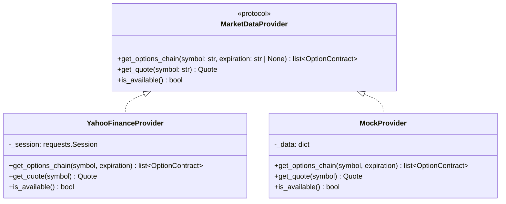
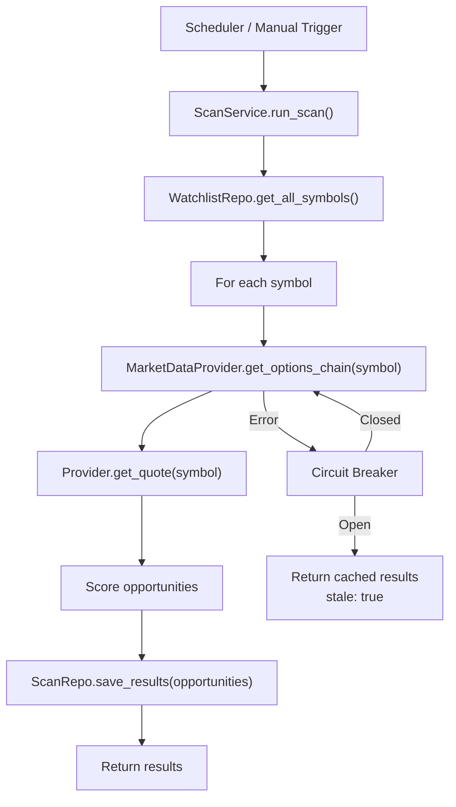
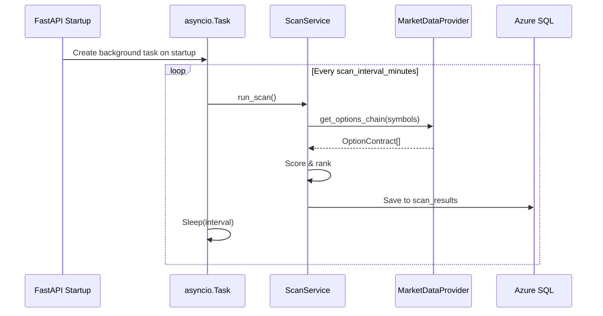

# Technical Specification: Real Market Data Integration & Background Scanning

**Issue**: #8, #9  
**Epic**: #1  
**Status**: Draft  
**Author**: Solution Architect Agent  
**Date**: 2026-02-14  
**Related ADR**: [ADR-1.md](../adr/ADR-1.md)

> **Acceptance Criteria**: See [PRD-1.md](../prd/PRD-1.md#5-user-stories--features) — Feature 4: US-4.1, US-4.2.

---

## 1. Overview

Replace hardcoded scan data with live options chain data from a market data provider. Add a background scheduler that periodically scans watchlist symbols and stores results. Expose a manual trigger endpoint.

**Scope:**
- In scope: Market data provider abstraction, Yahoo Finance implementation, options chain fetching, Greeks calculation/passthrough, opportunity scoring, background scan scheduler, scan results persistence
- Out of scope: Order execution, multi-broker support, AI-based scoring, WebSocket streaming

**Success Criteria:**
- `/api/scan` returns real options data for watchlist symbols
- Background task scans every N minutes (configurable, default 15)
- Manual scan via `POST /api/scan/trigger`
- Circuit breaker: if provider fails, return last cached results with `stale: true`

---

## 2. Architecture

### 2.1 Provider Abstraction



### 2.2 Scan Flow



### 2.3 Background Scheduler



---

## 3. API Design

### 3.1 Enhanced Endpoints

#### `GET /api/scan`

**Response** (backward-compatible, new optional fields):
```
{
  "status": "ok",
  "opportunities": [OptionOpportunity, ...],
  "scanTimestamp": 1707955200000,
  "stale": false,
  "source": "yahoo_finance"
}
```

New fields `scanTimestamp`, `stale`, `source` are additive — frontend can ignore them.

#### `POST /api/scan/trigger` (NEW)

**Request**: empty body  
**Response**:
```
{
  "status": "ok",
  "message": "Scan triggered",
  "resultsCount": 15,
  "scanTimestamp": 1707955200000
}
```

#### `GET /api/scan?symbol=META&minConfidence=70&sortBy=confidenceScore`

**Query Parameters** (all optional):
| Param | Type | Default | Description |
|-------|------|---------|-------------|
| `symbol` | str | all | Filter by symbol |
| `optionType` | str | all | CALL or PUT |
| `minConfidence` | float | 0 | Minimum confidence score |
| `minRiskReward` | float | 0 | Minimum risk/reward ratio |
| `sortBy` | str | confidenceScore | Sort field |
| `limit` | int | 50 | Max results |

---

## 4. Market Data Provider: Yahoo Finance

### 4.1 Implementation Details

**Library**: `yfinance` (BSD license, widely used, no API key required)

**Data Retrieved:**
- Options chain: all strikes for a given expiration
- Each contract: strike, bid, ask, last price, volume, open interest, implied volatility
- Quote: current underlying price, day range, volume

**Greeks Handling:**
- `yfinance` provides implied volatility per contract
- Greeks (delta, gamma, theta, vega) calculated using Black-Scholes model
- Utility function: `calculate_greeks(S, K, T, r, sigma, option_type)` in `app/providers/greeks.py`

### 4.2 Opportunity Scoring

Scoring algorithm (deterministic, not ML):

```
confidence_score = weighted_average(
    iv_rank_score     * 0.25,   # IV relative to 52-week range
    volume_oi_score   * 0.20,   # Volume/OI ratio (liquidity)
    risk_reward_score * 0.30,   # Potential gain / potential loss
    time_decay_score  * 0.15,   # DTE sweet spot (21-45 days)
    delta_score       * 0.10,   # Delta in optimal range (0.3-0.5)
)
```

Each sub-score normalized to 0-100 range.

### 4.3 Rate Limiting & Circuit Breaker

- **Yahoo Finance**: No official rate limit, but respect ~2 req/sec
- **Inter-request delay**: 500ms between symbol fetches
- **Circuit breaker**: After 3 consecutive failures → open circuit for 5 minutes → return cached data with `stale: true`
- **Cache**: Last successful scan results in `scan_results` table serve as cache

---

## 5. Configuration Additions

New fields in `Settings` dataclass:

| Setting | Env Var | Default | Description |
|---------|---------|---------|-------------|
| `market_data_provider` | `MARKET_DATA_PROVIDER` | `yahoo_finance` | Provider to use |
| `scan_interval_minutes` | `SCAN_INTERVAL_MINUTES` | `15` | Background scan interval |
| `scan_enabled` | `SCAN_ENABLED` | `true` | Enable background scanning |
| `circuit_breaker_threshold` | `CIRCUIT_BREAKER_THRESHOLD` | `3` | Failures before circuit opens |
| `circuit_breaker_timeout` | `CIRCUIT_BREAKER_TIMEOUT` | `300` | Seconds before retry |

---

## 6. Testing Strategy

| Type | What to Test | Target |
|------|-------------|--------|
| **Unit** | Scoring algorithm, Greeks calculation, circuit breaker logic | ≥80% |
| **Integration** | Scan endpoint with MockProvider, background scheduler start/stop | Happy + error paths |
| **Manual** | Live Yahoo Finance fetch (not in CI — rate limits) | Smoke test |

MockProvider returns deterministic data for tests — no network calls in CI.

---

## 7. Rollout

- [ ] Phase 2a: Create provider abstraction + MockProvider + ScanService refactor
- [ ] Phase 2b: Implement YahooFinanceProvider + Greeks calculator
- [ ] Phase 2c: Add background scheduler (FastAPI lifespan event)
- [ ] Phase 2d: Add `POST /api/scan/trigger` + query parameters
- [ ] Phase 2e: Deploy, monitor circuit breaker behavior

**Rollback**: Revert to hardcoded scan data by setting `MARKET_DATA_PROVIDER=mock` in env vars.

---

## 8. Risks

| Risk | Likelihood | Mitigation |
|------|-----------|------------|
| Yahoo Finance breaks/blocks | Medium | Circuit breaker + cached results + provider abstraction (swap to Tradier/Polygon later) |
| Greeks calculation inaccuracy | Low | Use well-tested Black-Scholes; compare against known values |
| Background task crashes | Low | Wrap in try/except; log errors; don't kill main app |
| Scan takes too long for many symbols | Medium | Limit to 20 symbols initially; parallelize later |

---

## 9. Dependencies

| Dependency | Version | License | Purpose |
|------------|---------|---------|---------|
| `yfinance` | latest | BSD | Options chain data |
| `scipy` | latest | BSD | Black-Scholes (norm.cdf for Greeks) |

Add to `requirements.txt`.

---

**Author**: Solution Architect Agent  
**Last Updated**: 2026-02-14
